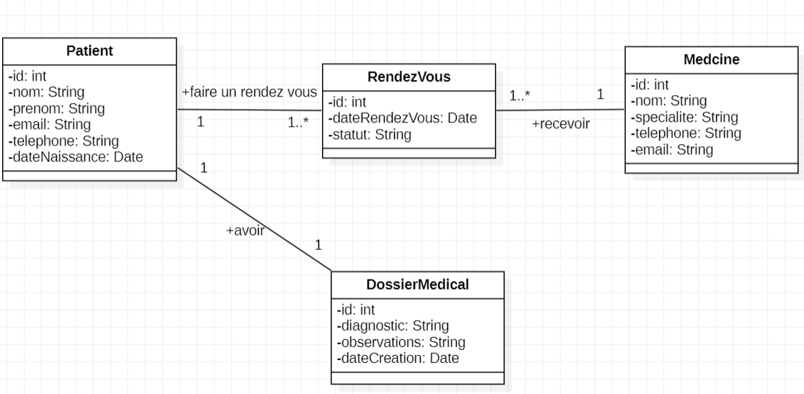
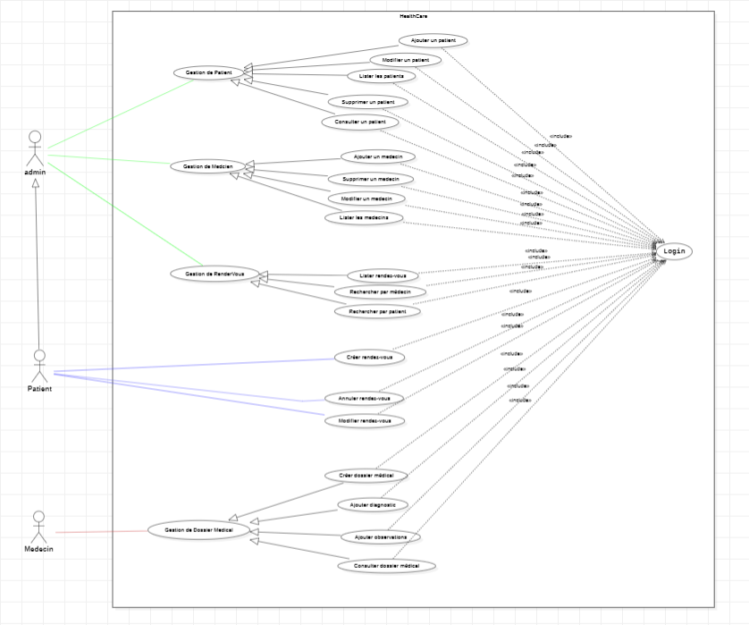
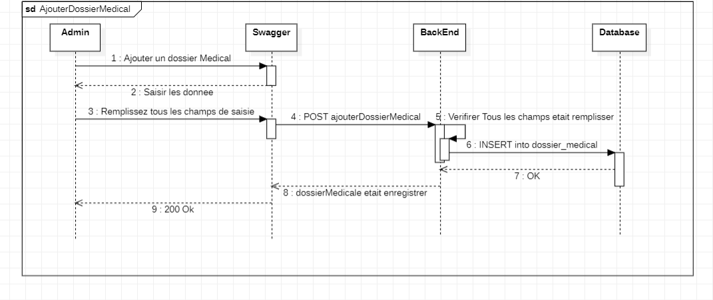
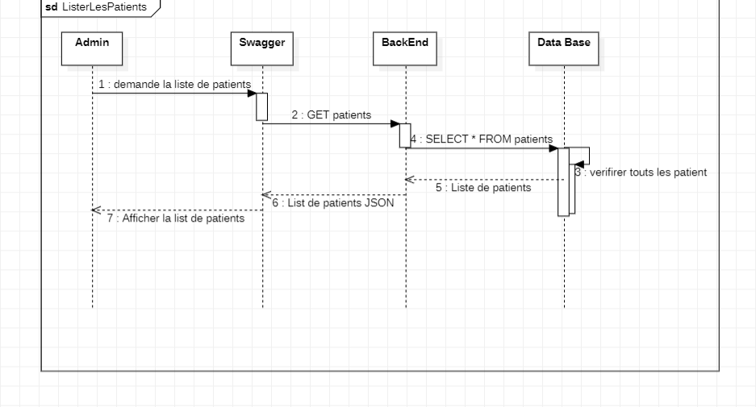
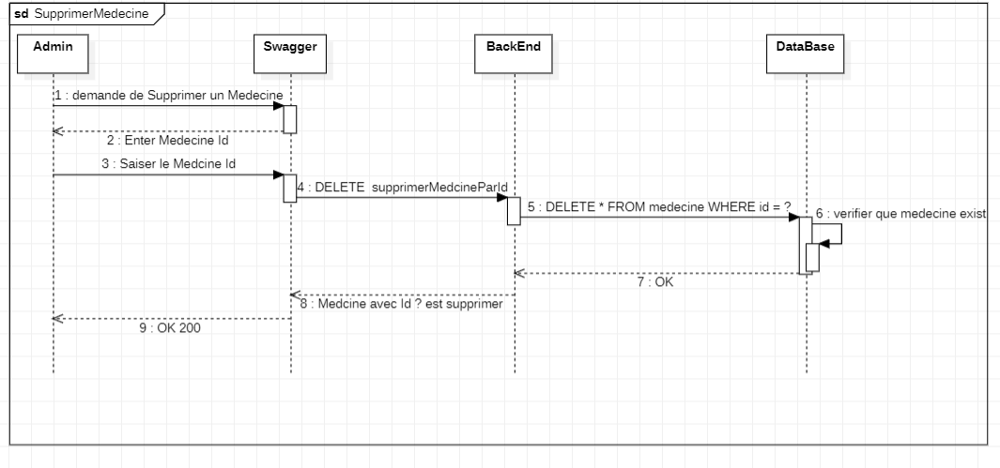
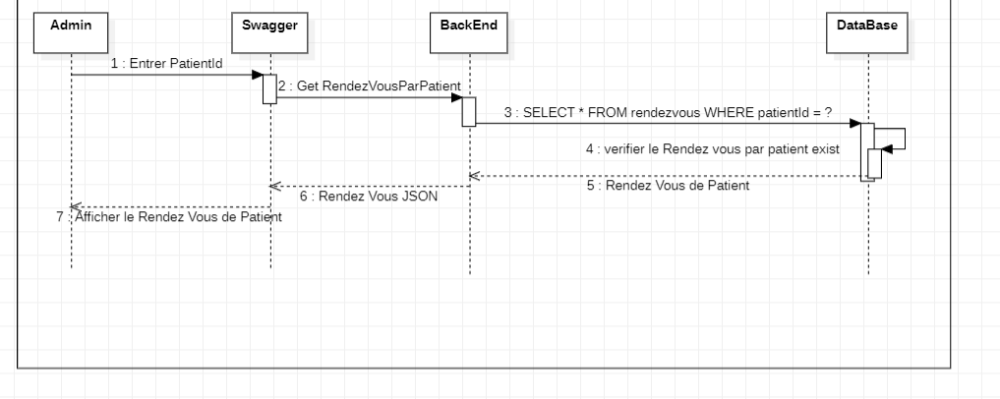

#HealthCare+ : Système de Gestion Médicale

Description
Le Système de Gestion Médicale est une application web développée avec Spring Boot.

Elle permet de gérer :

Les patients
Les médecins
Les rendez-vous
Les dossiers medical


Fonctionnalités
Gestion des Patients
Ajouter patient
Modifier patient
Supprimer patient
Lister patients
Consulter patient

Gestion des Médecins
Ajouter médecin
Modifier médecin
Supprimer médecin
Lister médecins

# Gestion des Rendez-vous
Créer rendez-vous
Modifier rendez-vous
Annuler rendez-vous
Lister rendez-vous
Rechercher par patient
Rechercher par médecin

# Gestion Dossier Médical
Créer dossier médical
Ajouter diagnostic
Ajouter observations
Consulter dossier médical


# Technologies Utilisées
Java 17 / 21
Spring Boot
Spring Data JPA / Hibernate / Flyway
Maven
SQL & Jointures
Derived Queries / @Query (SQL et JPQL)
Architecture MVC
REST API
DTO & Mapper (mapstruct)
JUnit
Docker & Dockerfile
Swagger
Git & Gitignore

# Structure du projet
src\
├── controllers\
├── services\
├── repositories\
├── models\
├── DTO\
└── mapper


# les trois diagrammes UML
# Diagramme de Classe


# Diagramme de Cas d'Utilisation


# Diagrammes de Séquence
exemple de ajouter Dossier Medical



exemple de lister medecins



exemple de supprimer Medecine Par Id



exemple de rendez_vous par patient



---

# Authentication

## Fonctionnalités
Inscription utilisateur
Connexion utilisateur et génération JWT token
Sécurisation des endpoints API
Validation du token JWT
Gestion de l'expiration du token (10 heures)

## Concepts Utilisés
AuthenticationManager
PasswordEncoder (BCrypt)
JWT Filter
SecurityFilterChain
UserDetailsService
DaoAuthenticationProvider

---

## Tester avec Postman

### 1. Inscription
- Method: `POST`
- URL: `http://localhost:8081/api/auth/register`
- Body:
```json
{
  "userName": "john_doe",
  "email": "john@example.com",
  "password": "securePassword123"
}
```
- Réponse: `User registered successfully`

### 2. Connexion (Login)
- Method: `POST`
- URL: `http://localhost:8080/api/auth/login`
- Body: même que l'inscription
- Réponse: le JWT token
```json
{
  "token": "eyJhbGciOiJIUzI1NiIsInR5cCI6IkpXVCJ9..."
}
```

### 3. Utiliser le Token
- Copier le token de la réponse login
- Pour les endpoints sécurisés, ajouter header:
  - Key: `Authorization`
  - Value: `Bearer YOUR_TOKEN_HERE`

### Endpoints Sécurisés
- GET `/api/patients` - Lister patients
- GET `/api/medecins` - Lister médecins
- GET `/api/rendezvous` - Lister rendez-vous
- GET `/api/dossier-medical` - Consulter dossiers

Sans token → 401 Unauthorized
Token expiré → 403 Forbidden
